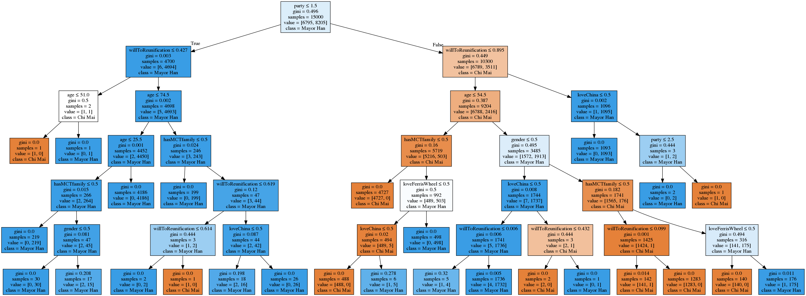
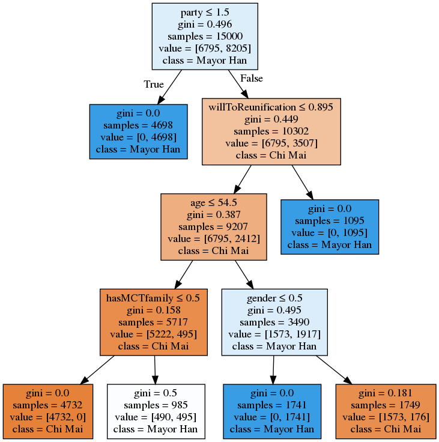

# Report

## Compare the rules

### (a). Original rules v.s rules generated by decision tree

#### Original rules:
 

1. if one's party is KMT => fan of Mayor Han
2. if one's willing to reunification with China over 70% => fan of Mayor Han
3. if one's gender = 'Female' and age >= 55 => fan of Mayor Han
4. if one match 2 or more rules listed below => fan of Mayor Han
    - loveChina = 1
    - hasMCTfamily = 1
    - loveFerrisWheel = 1

#### Generated rules:


### (b). Observation
- The generated rules is almost the idea that I originally thought of. The first 2 rules perfectly match. 
- For the third rules, the basic ideas are the same, which checks one's gender and one's age.
- As for the fourth rules, which 2 or more conditions must match, there are a little differences between them. To the Decision Tree, checking only age and gender wasn't enough for it to decide whether or not one is a fan of Han. Instead, it checks again for additional attributes such as 'hasMCTfamily'.
- An apparent difference is that attribute 'loveChina' didn't appear in Decision Tree. I think that's mainly because the condition that labels this attribute as 'true' is a little strict, thus this attribute only occupied a rather small part in the dataset, which wasn't powerful enough to determine the result.

## Futher Discussion
### (a). If we add some noise to the dataset, what will the tree be like?
```
test_data = pdata.copy()

# randomly select rows to add noise
idx = list(random.randint(0, 20000-1) for x in range(1, 50))
print(idx)
for i in idx:
    test_data.loc[i] = [
        random.randint(0, 1),
        random.randint(20, 90),
        random.randint(1, 3),
        random.uniform(0, 1),
        random.randint(0, 1),
        random.randint(0, 1),
        random.randint(0, 1),
        random.randint(0, 1)
    ]

test_data_train = test_data[:15000]
test_data_test = test_data[15000:]
test_y = test_data_train['fanOfHan'].values
test_data_train = test_data_train.drop('fanOfHan', axis=1)
```

```
dtree.fit(test_data_train, y)

dot_data = StringIO()
export_graphviz(dtree, 
                out_file=dot_data,  
                filled=True, 
                feature_names=list(test_data_train),
                class_names=['Chi Mai','Mayor Han'],
                special_characters=True)

graph = pydotplus.graph_from_dot_data(dot_data.getvalue())
```



### What about the accuracy?
```
y_test = test_data_test['fanOfHan'].values
X_test = test_data_test.drop('fanOfHan', axis=1)

y_predict = dtree.predict(X_test)

accuracy_score(y_test, y_predict)
```
#### accuracy: 0.9986

### Observation

- The tree became much more complicated.
- It shows that Decision Tree is prone to noise, even though only 0.25% of dataset is randomly made.
- However, it seems like that the accuracy isn't affected that much. The tree is still well functioning whle it looks complicated.

### (b). If we reduce the depth of Decision Tree, how will the result be?
```
dtree=DecisionTreeClassifier(max_depth=4) # reduce the depth
dtree.fit(pdata_train, y)

dot_data = StringIO()
export_graphviz(dtree, 
                out_file=dot_data,  
                filled=True, 
                feature_names=list(pdata_train),
                class_names=['Chi Mai','Mayor Han'],
                special_characters=True)

graph = pydotplus.graph_from_dot_data(dot_data.getvalue())
graph.write_png("test_depth.png")
```


#### accuracy: 0.9534

### Observation
- At the bottom, there are still lots of values that couldn't be classified.
- The accuracy turns out poorer.
- This is because the rules aren't as many as the original ones to represent the results due to the depth of tree.
