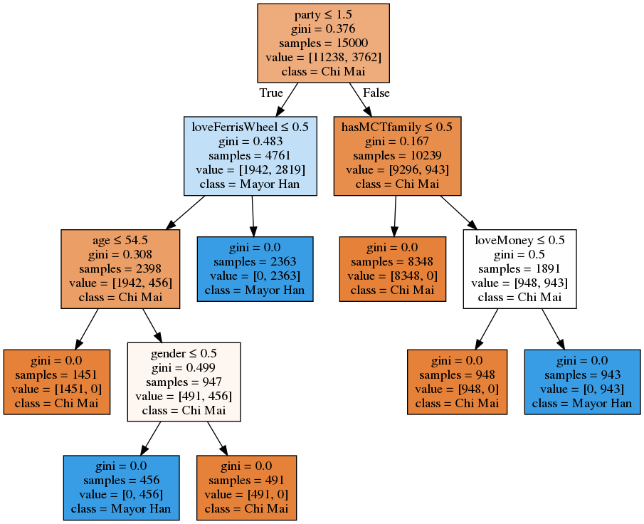

# Report

## Compare the rules

### (a). Original rules v.s rules generated by decision tree

#### Original rules:


#### Generated rules:



### (b). Observation
- The generated rules is exacly the idea that I originally thought of, though the rule order is slightly different.

## 7. Futher Discussion
### (a). If we try a more complicated rules, will the tree still look similar ?

```
test_data = pdata.copy()
test_data = test_data.drop('fanOfHan', axis=1)
test_data['fanOfHan'] = 0
# complicated rules
for index, row in test_data.iterrows():
    if (row['party'] == 1):
        test_data.at[index,'fanOfHan'] = 1
    else:
        if (row['loveMoney'] == 1):
            if (row['loveFerrisWheel'] == 1):
                test_data.at[index,'fanOfHan'] = 1
        else:
            if (row['hasMCTfamily'] == 1):
                if (row['party'] == 2):
                    test_data.at[index,'fanOfHan'] = 1
            else:
                if (row['age'] >= 55):
                    if (row['gender'] == 0):
                        test_data.at[index,'fanOfHan'] = 1
```

```
# split to train, test, y
test_data_train = test_data[:15000]
test_data_test = test_data[15000:]
test_y = test_data_train['fanOfHan'].values
test_data_train = test_data_train.drop('fanOfHan', axis=1)

# draw the tree
dtree=DecisionTreeClassifier(max_depth=10)
dtree.fit(test_data_train, y)

dtree.fit(test_data_train, test_y)
dot_data = StringIO()
export_graphviz(dtree, 
                out_file=dot_data,  
                filled=True, 
                feature_names=list(test_data_train),
                class_names=['Chi Mai','Mayor Han'],
                special_characters=True)

graph = pydotplus.graph_from_dot_data(dot_data.getvalue())
graph.write_png("imgs/test_complicated.png")
```


### (b). If we add some noise to the dataset, what will the tree be like ?

```
test_data = pdata.copy()

# randomly select rows to add noise
idx = list(random.randint(0, 20000-1) for x in range(1, 50))
print(idx)
for i in idx:
    test_data.loc[i] = [
        random.randint(0, 1),
        random.randint(20, 90),
        random.randint(1, 3),
        random.uniform(0, 1),
        random.randint(0, 1),
        random.randint(0, 1),
        random.randint(0, 1),
        random.randint(0, 1)
    ]

test_data_train = test_data[:15000]
test_data_test = test_data[15000:]
test_y = test_data_train['fanOfHan'].values
test_data_train = test_data_train.drop('fanOfHan', axis=1)
```

```
dtree.fit(test_data_train, y)

dot_data = StringIO()
export_graphviz(dtree, 
                out_file=dot_data,  
                filled=True, 
                feature_names=list(test_data_train),
                class_names=['Chi Mai','Mayor Han'],
                special_characters=True)

graph = pydotplus.graph_from_dot_data(dot_data.getvalue())
```


### What about the accuracy?
```
y_test = test_data_test['fanOfHan'].values
X_test = test_data_test.drop('fanOfHan', axis=1)

y_predict = dtree.predict(X_test)

accuracy_score(y_test, y_predict)
```
#### accuracy: 0.999

### Observation

- The tree became much more complicated.
- It shows that Decision Tree is prone to noise, even though only 0.25% of dataset is randomly made.
- However, it seems like that the accuracy isn't affected that much. The tree is still well functioning whle it looks complicated.

### (c). If we reduce the depth of Decision Tree, how will the result be?
```
dtree=DecisionTreeClassifier(max_depth=4) # reduce the depth
dtree.fit(pdata_train, y)

dot_data = StringIO()
export_graphviz(dtree, 
                out_file=dot_data,  
                filled=True, 
                feature_names=list(pdata_train),
                class_names=['Chi Mai','Mayor Han'],
                special_characters=True)

graph = pydotplus.graph_from_dot_data(dot_data.getvalue())
graph.write_png("test_depth.png")
```


#### accuracy: 0.9658

### Observation
- At the bottom, there are still lots of values that couldn't be classified.
- The accuracy turns out poorer.
- This is because the rules aren't as many as the original ones to represent the results due to the depth of tree.
